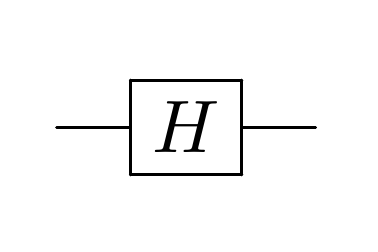
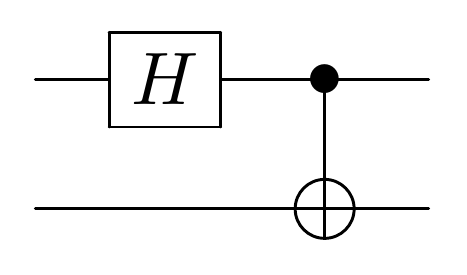
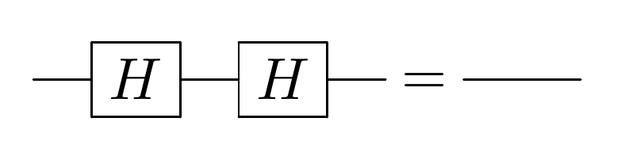
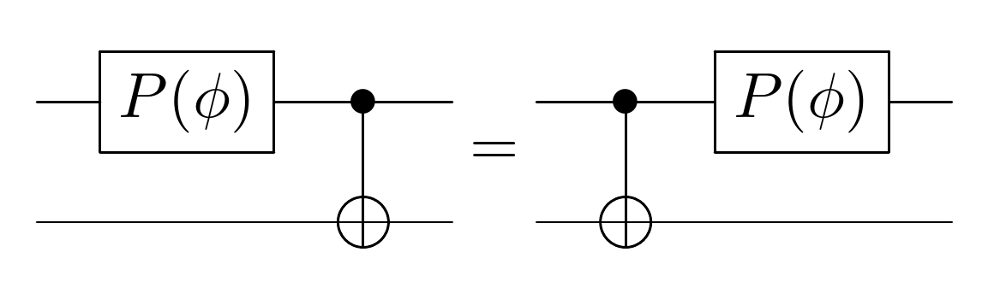

Formalisation of an Incomplete Equational Theory for Quantum Circuits
=====================================================================

This repository contains a first-order formalisation of the $QC_0$ portion of the complete axiomatisation for ancilla-free quantum circuits presented in \[[1]\]. Axioms for $QC_0$ are given in the TPTP format \[[2]\], as well as axioms for arithmetic modulo $n$, and there are also tools to write circuits in a convenient notation and convert it to TPTP. There are also example problems in the $QC_0$ theory, such as some of the corollaries in \[[1]\] as well as other true and false conjectures.

## Contents

- `Axioms/QUA001-1.axq`: Axiomatisation of $QC_0$. 
- `Axioms/gen-ARI001-0.py`: Generator for an axiomatisation of arithmetic modulo $n$. 
- `Problems/QUA0xx-1.pq`: Corollaries in \[[1]\]. 
- `Problems/QUA1xx-1.pq`: Other true conjectures.
- `Problems/QUA2xx-1.pq`: Other false conjectures.
- `Problems/QUAxxx-1.min.pq`: Variants where only the necessary axioms are given, rather than the whole $QC_0$.
- `Solutions/QUAxxx-1.n.sq`: Step `n` of a proof of problem `QUAxxx-1`. 
- `Solutions/QUAxxx-1.n.min.sq`: Variants where only the necessary axioms are given, rather than the whole $QC_0$. 
- `Tools/preprocess.py`: Tool to parse the `$(…)` macros containing custom notation. 

These files use custom notation inside `$(…)` macros (see below). Use `Tools/preprocess.py` to preprocess them into valid tptp files to feed into any theorem prover of your choosing (the script reads from stdin and writes to stdout). 

## Build

Run `make` to preprocess all files in the repo (`.axq` → `.ax`, `.pq` → `.p`, `.sq` → `.s`) and generate an `ARI001` instance. 

## Custom notation

The encoding of quantum circuits is cumbersome and hard to read and write directly, so we provide a small tool that parses notation inside `$(…)` into that encoding. 

A gate over `n` qubits, applied to qubits `q1`, …, `qn` is notated `<gate> <q1> … <qn>`. 
A sequence of gates is notated by a `-` separated pipeline, where the first element is the initial state and the rest are the gates in order of application. 
A global phase is notated on the initial state with `o(<phase>,<state>)`. 

When notating formulas over many-qubit quantum circuits, we need to assert that the qubits are distinct. When using this notation this is automatic; simply wrap your entire formula in another `$(…)`

Examples:

| Notation | Circuit | TPTP |
| --- | --- | --- |
| <pre>$(S - h Q)</pre> |  | <pre>app1(h,Q,S)</pre> |
| <pre>$(S - h Q1 - cnot Q1 Q2)</pre> |  | <pre>app2(cnot,Q1,Q2,app1(h,Q1,S))</pre> |
| <pre>cnf(example, plain,   $(S - h Q - h Q) = S ).</pre> |  | <pre>cnf(example, plain,   app1(h,Q,app1(h,Q,S)) ).</pre> |
| <pre>cnf(example, plain,$(   $(S - p(φ) Q1 - cnot Q1 Q2) =   $(S - cnot Q1 Q2 - p(φ) Q1) )).</pre> |  | <pre>cnf(example, plain,   app2(cnot,Q1,Q2,app1(p(φ),Q1,S)) =   app1(p(φ),Q1,app2(cnot,Q1,Q2,S))   \| Q1=Q2 ).</pre> |

## References

Alexandre Clément, Nicolas Heurtel, Shane Mansfield, Simon Perdrix, Benoit Valiron. “A Complete Equational Theory for Quantum Circuits”. \[[1]\]

[1]: https://arxiv.org/abs/2206.10577

[2]: https://tptp.org/
